  

 

I'm Agastya, a student from Pune who can't stop starting things.

Most people I know either build or sell. I try to do both. I design the product, ship it, then go do the unglamorous half: cold emails, Reddit posts, sales calls, until someone who isn't my friend is using it. Then I start again.

I like software that feels calm and does one thing well. Linear, Notion, Resend and Cal.com are the bar I hold my own work to.

 

### Things I've made

| Project | Status | What it is |
|:--|:--|:--|
| **[Duelistt](https://duelistt.com)** | building | A cold outreach tracker for people who outreach, just like me. Not a CRM, just the nag you actually want. |
| **[Afterward](https://afterward.fyi)** | shut down | An AI decision simulator that played out the GO and STAY versions of a big choice. 80+ signups and a first paying user from Reddit alone, zero ad spend. I closed it and kept the lessons. |
| **FitPitch** | experiment | Scores how well a lead fits your offer and writes the opening line of the cold email. Built to see if I could sell a tiny paid tool. |

 

  

 

### Off the keyboard

I look at the sky more than most people in a city should. I also write about the quieter side of building, the spiritual stuff nobody puts in a launch post, on Instagram.

 

### Find me

[Instagram](https://instagram.com/agastya.speaks) &nbsp;/&nbsp; [X](https://x.com/agastyabuilds) &nbsp;/&nbsp; [Email](mailto:sharmaagastya72@gmail.com)

 

<i>last commit: today. there's always a next one.</i>

