  

 

<table>
<tr>
<td width="50%" valign="top">

### [Afterward](https://afterward.fyi)

Stuck between leaving and staying? Afterward plays both futures forward, the GO path and the STAY path, and tells you how sure you really are.

**80+ signups** and a first paying customer, all from Reddit posts I wrote myself. Zero ad spend.

Next.js · Gemini · Prisma · Neon · Clerk · Vercel

</td>
<td width="50%" valign="top">

### [Duelistt](https://duelistt.com)

Still building. The commits are going in right now, and the graph above will get a new line when it ships.

[Tracker for people who cold outreach just like me.]

[stack] · [stack] · [stack]

</td>
</tr>
</table>

 

### You've got a decision to make

Afterward is about GO vs STAY, so this profile is too. Pick one.

<b>GO</b> &nbsp;I'm building something and want to talk to someone who ships and sells

 

Good. I like people who are in the middle of something. Tell me what you're building, what's stuck, or what you're trying to sell.

[Instagram @agastya.speaks](https://instagram.com/agastya.speaks) &nbsp;/&nbsp; [Email](mailto:sharmaagastya72@gmail.com) &nbsp;/&nbsp; [X](https://x.com/agastyabuilds)

<b>STAY</b> &nbsp;I'm just scrolling

 

Fair. Afterward's simulation for this path: in six months you'll remember a guy from Pune who was building in public, and you'll wish you'd hit follow.

Cheaper to just hit follow.

 

<i>last commit: today. there's always a next one.</i>

